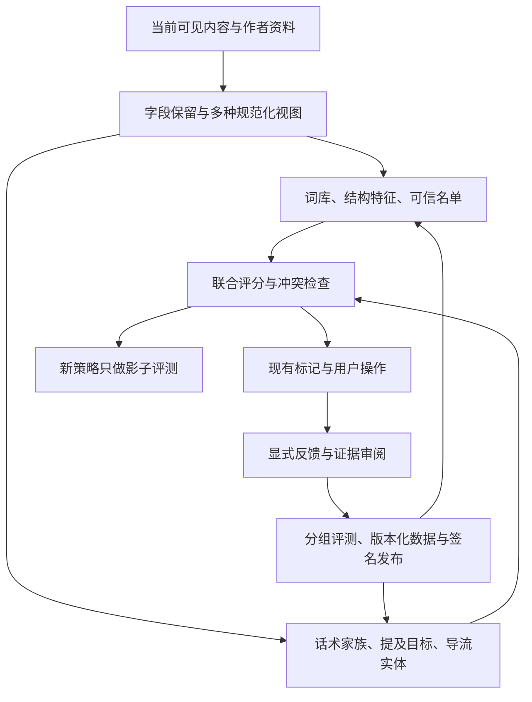

**FeedSieve 黄推与垃圾引流识别调研｜2026-09-13**

本次结论：继续开源完全可行。最值得投入的方向，是把现有词库、局部组合规则和社区反馈，升级为可评测的多信号识别系统，并利用垃圾账号之间重复的内容与导流关系。不存在一个能永久解决对抗的关键词表或模型；应把目标定为持续降低误标与漏标，并提高对方维持大规模垃圾投放的成本。

本报告基于当前代码、最近提交的 diff、生产 D1 只读查询、线上公开快照与词库、实际生产检测函数回放，以及公开的一手技术资料。第 1 至 9 节记录实施前的审计基线；第 10 节记录随后完成并上线的第一阶段。原始上报材料留在本机临时审计目录，仓库中仅保存汇总结果。

**1. 代码与线上版本不是同一个状态**

审计起点为 `eb469b9`，工作区没有未提交改动，`main` 比本地记录的 `origin/main` 多 5 个提交。这不是一次实时远程分支同步结果。

本次重点评估了 `a6666ed` 的拼音变体、比较话术与主页引流优化，以及此前的 Unicode 归一化、号码引流、弱信号组合、SimHash v1、签名词库与扫描缓存改动。

| 对象 | 本次读取结果 |
|---|---|
| 线上词库 | `2026.09.12.4`，660 条规则，2 个分类 |
| 当前仓库词库 | `2026.09.13.2`，760 条规则 |
| 线上公开名单 | `2026.09.13.1`，3,496 个条目 |
| 公开名单生成时间 | 2026-09-13 08:00:51，北京时间 |
| 词库差异 | 本地独有 105 条；线上独有 5 条；共有规则内容一致 |

线上独有的 5 条包含 `不是人机`、`想找单男`、`那一夜你没有拒绝我`、`hardcore`、`amateur`。其中有些属于应当收窄的宽泛词，不能为了追回覆盖率就全部恢复。发布前应把“新增覆盖”和“主动收窄导致的覆盖变化”分别审阅。

你今天的改动有实际价值：针对完整短语生成拼音家族，比全局把所有拼音强行替换成敏感汉字更可控；英文整词匹配及正常语境守卫也应保留。但是词条展开仍在维护有限的表达集合，不能独自解决改写、图片引流或批量换号问题。

版本证据：[线上词库 manifest](https://api.feedsieve.win/v1/keyword-packs/latest)、[公开名单 manifest](https://api.feedsieve.win/v1/snapshots/latest)。这些链接会随发布更新，固定观察结果见[审计汇总 JSON](/Users/kim/code/feedsieve/docs/research/DETECTION_AUDIT_2026-09-13.json)。

**2. 线上已经有规模，但还不是可直接训练和计算识别率的数据集**

下面的主统计固定于 **2026-09-13 09:34:47，北京时间**。

| 指标 | 数量 | 正确解释 |
|---|---:|---|
| accounts | 15,150 | 包含候选账号，不等于最终名单 |
| reports | 39,842 | 按安装与账号去重、可更新的上报关系，不是全部历史点击 |
| rescues | 2,630 | 用户的误标或抢救反馈，不等于已经核实的误杀 |
| installations | 2,576 | 匿名安装记录，不等于独立真人 |
| 当前 blocked 标签 | 39,691 | 当前投票关系 |
| 当前 allowed 标签 | 2,575 | 当前反向投票关系 |
| D1 strong 账号 | 3,566 | 此时满足正式社区公式的账号 |
| 带任一正文、昵称或简介材料的报告 | 1,578 | 仅占 reports 的 3.96% |

事实字段在 9 月 12 日才开始积累。主统计中只有 998 条报告带正文、1,001 条带昵称、803 条带简介，字段之间有重叠。18,061 条 manual 报告里只有 9 条带正文，579 条带简介。历史客户端没有这些字段，不能把这个比例全归因于当前代码；但当前手动标记路径也确实存在正文传递缺口。

报告来源只有 `manual` 和缺省两种：18,061 条 manual，21,781 条来源缺省。正向报告没有 rule_id 字段，而反向反馈有；这使得“某条规则获得多少确认、多少反对”无法对齐。后续补查还发现，现存 reports 的 `evidence_post_id` **全部为空**。

这些材料不能给出线上真实 precision/recall，原因有四个：

- 只看到用户主动上报或反馈的内容，未命中且未上报的垃圾仍不可见。
- 缺少随机抽取并独立审阅的正常内容作为分母。
- 用户拉黑可能反映个人偏好；社区票也可能错误或被操纵。
- 同一账号、话术和推文的重复材料需要分组去重，不能当作独立样本。

**3. 对你的优化做了生产函数回放，增益可以看见**

我直接加载 `runDetectionPipeline` 和真实关键词构建函数，以默认订阅、standard 档运行。固定当前引擎代码，只在“线上词库”和“仓库新版词库”之间切换；社区账号名单、内置名单与社区指纹均不参与这组实验，以免被已经上报的账号名单掩盖内容规则的能力。

1,578 条原始报告按 handle、正文、昵称、简介和域名输入精确去重后，得到 1,428 份材料，涉及 1,166 个账号。其中 **993 份有正文，涉及 782 个账号**。这是输入级去重；没有 post_id，且昵称中混入了时间，因此还不是推文级、话术家族级的独立测试集。

| 有正文的 993 份材料 | 线上词库 + 当前引擎 | 仓库新版词库 + 当前引擎 |
|---|---:|---:|
| 内容规则标记数 | 713 | 823 |
| 这组材料上的标记覆盖 | 71.80% | 82.88% |
| 未标记 | 280 | 170 |

新版新增标记 125 份，同时有 15 份失去旧词库标记，净增 110 份，即 11.08 个百分点。失去覆盖的 15 份均涉及线上 `不是人机` 规则。应以更具体的组合或话术家族补足，而不是直接恢复这条泛化过度的单词规则。

**这些数字是所选上报材料的条件覆盖率，不是线上召回率，也不证明新增标记都正确。** 两列都使用当前引擎，不能把左列称为旧扩展的完整线上表现。

剩余 170 份有正文的未标记材料中：

| 观察到的表达家族 | 份数 |
|---|---:|
| “只进入身体 / 不进入生活”及顺序、emoji 变体 | 62 |
| “比她好看的没她骚……”及插入短字符、提及变体 | 14 |
| 带“不是人机”的重复句式 | 15 |
| 其他材料 | 79 |

这三组就占 91 份。其他材料中也出现普通短评论、调用 Grok、加密货币内容和广告，不能全部认定为黄推漏报。

另有 435 份材料没有正文，新版只标记 3 份。这主要暴露了输入不足；训练一个更大的模型也无法还原丢失的正文。

**4. 比继续加词更优先的具体问题**

| 优先级 | 证据与问题 | 建议 |
|---|---|---|
| P0 | 未命中时，scan 只把 handle 和指纹/域名传给手动按钮；后续从 pageMarked 回查正文，而未命中的帖子通常不在其中 | 点击时携带同一份完整 FeedItem 与实际 bio，保留 post_id、字段来源及采集时间 |
| P0 | 目前的“precision=1、recall=1”使用规则预期作为标签；6 条 known_limitation 都 expected=null，因此被计入 TN；测试装配还与生产装配不同 | 把真假标签、预期规则、预期操作分开，真实指标统一走生产链路 |
| P1 | weakSignalCombo 把正文和简介拼在一起，再检查纯 emoji / 单词沙拉形状 | 分字段提取特征；普通简介的出现不应抹掉正文中已存在的形状证据 |
| P1 | contact-number-bait 直接匹配原始数字，未复用 NFKC 等归一化 | 建立公共多视图输入，号码与关键词都消费适合自身语义的规范化视图 |
| P1 | 有序词组匹配贪心采用第一个起点，超出 max_gap 就直接返回 | 保留后续合法起点，或以位置索引/小状态机完成有界序列匹配 |
| P1 | 合法的部分 detector_config 更新没有先回到默认值，旧包参数会残留 | 每次根据“默认值 + 当前包覆盖”生成完整配置，再一次性切换 |
| P1 | 数字形状账号 + 两个昵称 emoji 已足以标记正常正文 | 将装饰性、账号形状归为低权重相关证据；要求实际内容或导流关系佐证 |
| P1 | 996 份有昵称的去重材料中，909 份昵称末尾带分钟/小时等时间文本；3 份正文混入“谷歌翻译” | 优先消费已经收到的 X 原始字段，DOM 兜底应精确定位作者名和原文 |
| P2 | 昵称、正文、简介的证据没有统一关联到同一次观察；reports 更新使用多个 COALESCE | 保留不可变证据事件，当前投票另表维护，避免不同时间的材料拼成一个伪现场 |

已复现的合成诊断包括：同一单词沙拉正文在加上普通简介后，从标记变为未标记；号码的全角及零宽插入版本未命中；普通摄影昵称带两个 emoji 被 weak-signal-combo 标记；正常售后联系电话被号码规则标记；引述垃圾话术的反垃圾说明被关键词标记。这些是人工构造的边界案例，不是线上误杀率统计。

有序词组诊断中，`同城上门` 能匹配；在前面增加一个与后续相距过远的“同城”后，文本末尾仍存在完整合法匹配，单条规则却返回未命中。配置诊断中，A 包改变 trailingDigits，B 包仅覆盖其他 section 后，A 的值仍然存活。这两处都是可独立修复的实现问题。

主要位置：[手动动作](/Users/kim/code/feedsieve/apps/extension/src/lib/content/manual-actions.ts:27)、[正文回查](/Users/kim/code/feedsieve/apps/extension/src/lib/content/block-core.ts:113)、[生产入口](/Users/kim/code/feedsieve/apps/extension/src/lib/detection/detection-pipeline.ts:125)、[弱信号与号码规则](/Users/kim/code/feedsieve/packages/detector/src/heuristics.ts:389)、[词组匹配](/Users/kim/code/feedsieve/apps/extension/src/lib/detection/keyword-rules.ts:207)、[配置覆盖](/Users/kim/code/feedsieve/packages/detector/src/config.ts:125)、[昵称提取](/Users/kim/code/feedsieve/packages/x-adapter/src/reader.ts:70)、[现有 corpus 指标](/Users/kim/code/feedsieve/packages/detector/src/corpus.test.ts:41)。

**5. 当前 SimHash 有用，但承担不了“聪明识别”的全部责任**

你的 SimHash 以字符 n-gram 为特征。它衡量的是字面特征相似，不是理解“同一个意思”。当前 v1 只有 60 个有效哈希位，距离阈值为 2。在两组短话术诊断中，插入很少的混合字符后，汉明距离分别变为 12 和 11，因此不会被这道阈值视为近似模板。不能据此简单把阈值增大到 12，因为误配范围也会扩大。

线上名单带有 1,169 个不同指纹，其中 816 个为 v1，353 个仍为旧 v0。仓库已记录 v0 的位分布退化问题，但客户端仍执行 v0 近似匹配。本次将线上指纹与 corpus 中 30 条非 known_limitation 的正常守卫做独立比对，v0 误命中其中 1 条，v1 在这组小样本中未命中。这个结果支持优先审查旧 v0；30 条守卫不足以证明 v1 的误报率足够低。

后续反馈查询中，SimHash 近似规则有 496 条误标反馈，涉及 400 个账号；弱信号组合有 222 条，涉及 165 个账号。这些是用户反馈，缺少曝光分母与独立复审，不能解释为规则误报率。它们足以确定人工复核的优先队列。查询比主统计晚，数量有自然增长。

对内容规则漏掉的 170 份材料，用当前线上指纹单独回查，v1 能找到 100 份，v0 能找到 85 份，两者有重叠。由于指纹也来自这些用户报告，这存在同源证据泄漏，不能当作新账号泛化成绩。它证明的是“已有一些模板资产可以被利用”，不是“全量开启指纹就解决漏判”。

建议按这个方向改造：

- 显式记录指纹算法版本，把规范化精确摘要与近似指纹分开；SimHash 值相等不应被解释为原文严格相等。
- 正文、简介分别建特征；按话术片段保留局部特征，降低短随机前后缀对整段指纹的影响。
- 字符 n-gram、MinHash/局部片段索引可用作候选召回，再用实际相似度与额外证据复核；距离门槛通过独立负样本校准。
- 旧 v0 的近似命中降权或进入隔离评估；有原文的记录重算，缺原文的等待重新证实及到期淘汰。
- 当前 campaign 使用共享指纹归簇，宜将“模板相似”与“协同投放”区分；相似文本本身不能证明恶意协同。

静态阅读还发现 `clusterCampaigns` 的单遍贪心扩展依赖输入顺序：早先被拒绝的节点不会在出现连接节点后重新检查，不能保证找到完整连通分量。未来应使用确定性的候选索引与连通分量算法，并限制弱边的传递扩散，避免靠桥接文本合并不相关群体。[聚类实现](/Users/kim/code/feedsieve/apps/community-api/src/snapshot.ts:118)

**6. 更适合继续开源的架构**

建议保留“本地优先、社区名单、AI 处理模糊案例、用户决定拉黑”的既有方向，先把局部组合提升为统一证据层。

**第一层：统一提取特征，再共同判断。**

目前已有数字形状的局部计分，下一步应让规则返回结构化证据，包括字段、原始片段位置、规范化方式、证据家族、强弱、缺失状态和版本。不要把第一条命中直接当作全部判定依据。

证据可分为内容意图、导流实体、账号形态、群体行为、经审阅的社区判断，以及正常上下文。最终评分可以从简单的逻辑回归或可解释加权模型起步。同一文本的多个拼音/emoji/字符变体只能算同一证据家族；数字比例与长数字尾缀也高度相关，不能冒充两个独立证据。

缺少 bio 应标为未知，不应等价为正常或异常。原文和规范化视图应并存：字符相似性存在歧义，不应把映射后的结果当作无损原文。否定句、引用、新闻和客服语境可以参与降权，但不能设计成包含某个“免责声明”就永久放行的硬开关。[Unicode 字符安全机制](https://www.unicode.org/reports/tr39/)

公开开源反垃圾系统 Rspamd 已把多个规则信号、统计分类与模糊指纹结合使用，其 neural 模块也能学习过滤器共同触发的模式。适合借鉴的是这类组合方式；邮件上的表现不能直接迁移为 FeedSieve 的准确率承诺。[Rspamd 机制说明](https://docs.rspamd.com/getting-started/understanding-rspamd/)、[neural 模块](https://docs.rspamd.com/modules/neural/)

**第二层：识别投放家族及导流关系。**

本次未标记材料里出现多个账号反复发布同族句子，并提及相同目标账号。现有指纹归一化把 @目标替换成同一个占位符，links 又主要保留域名，丢失了“多个壳账号正在把流量送到同一处”的信息。

可在已收到的数据中提取：稳定 x_user_id、提及目标、已展开链接、简介中的公开联系方式、局部模板特征，以及在当前可观察窗口内的重复行为。为“账号—模板—导流目标”建立关系。下发的是经过审阅、带来源和有效期的关系证据，单纯共享 Telegram、常见域名或热门账号不能直接推导为垃圾。

跨账号相似行为和时间模式可用于发现协调网络，有现成学术方法可参考；FRAUDAR 则说明了利用关系结构研究伪装攻击的价值。但 FeedSieve 看不到 X 全站关系，本项目应先实现可观察范围内的小型关系索引，不能把论文的大图实验结果视为自己的能力。[ICWSM 2021 协调网络研究](https://ojs.aaai.org/index.php/ICWSM/article/view/18075)、[FRAUDAR 原论文](https://www.kdd.org/kdd2016/papers/files/rfp0110-hooiA.pdf)

这是比持续列举字词更值得投入的方向：对方只改一句话，原有的导流目标和重复行为仍可能留下证据。这是提高对抗成本的工程推断，不是保证无法绕过。

**第三层：以小模型作为可比较的挑战者。**

先建立字符 n-gram + 逻辑回归基线，或明确启用字符子词的 fastText。它们适合低成本尝试错字、拼音混写与短语组合，对中文需要验证切分方式，不能直接照搬英文默认配置。字符特征对局部拼写变化具有一定适应性，但对同义改写、上下文及正常引用仍需额外特征与标签。[scikit-learn 文本特征](https://scikit-learn.org/stable/modules/feature_extraction.html)、[fastText 参数](https://fasttext.cc/docs/en/options.html)

再比较适合中文的句向量模型，例如 multilingual E5 系列，使用经过审阅的垃圾与正常原型做检索或分类。通用相似度不是垃圾概率，预训练模型也不了解最新引流黑话。先离线评测，若确实提高固定误报预算下的覆盖，再评估量化、蒸馏及端侧部署。[multilingual-e5-small 模型说明](https://huggingface.co/intfloat/multilingual-e5-small)

大模型可以协助维护者把新样本归类、总结家族、提出规则候选，但不能直接把未审阅输出变成投票、名单或训练真值。输入原文必须按不可信数据处理。模型不应拥有执行拉黑或发布规则的工具权限。

本次没有训练模型、调用付费模型或测试端侧模型运行速度，因此不能承诺具体模型增益、体积或费用。

**第四层：对图片做有边界的补充。**

当前 DetectInput 基本是文本、作者名、简介和链接，无法识别只放在头像/配图里的引流信息。若后续抽样证明这类漏判占比值得投入，可在已筛出的可疑案例上比较 OCR、图片感知指纹和内容分类。识别到成人图片也不等于识别到垃圾账号；正常成人创作者、医疗科普和新闻都需要区别。图片能力应与文本、导流关系一起评测，不应成为整个首屏必须等待的步骤。

**7. 开源对抗中，社区投毒与漏判同样重要**

正式入榜仍是 `blocked - allowed >= 3`。已有安装限额、IP 额度和 trust 衰减，但 trust 主要影响提交额度；带成熟度及证据条件的 consensus v2 仍是影子逻辑。

主统计中，3,566 个 strong 账号里有 **2,064 个在存储的 v2 状态中不达标**，占 57.88%。这说明 v2 切换会显著改变覆盖范围，不说明这些账号都是恶意刷票。成熟度还会随时间变化，切换前要以同一时间点重算，并按新旧安装、话术家族、确认证据和真实误标分层审阅。

安装 ID、多个同文报告、跨日投票都不天然证明独立真人。攻击者可以制造身份、重复提交一致材料或长期养身份；同一 IP 也可能是正常用户共享网络。针对单一实体伪造多个身份的风险，经典 Sybil 研究已有明确描述。[The Sybil Attack](https://www.microsoft.com/en-us/research/publication/the-sybil-attack/)

建议在现有影子模式中增加投票相关性分析、基于独立审阅的信誉校准、异常群体的共享预算，以及对短期一致材料的证据来源核验。不要只用“与当前多数票一致”训练信誉，否则会把既有错误自我强化。客户端安装密钥可防重放和确认连续性，也不能凭空证明真人唯一性。

黑名单与 verified 社区白名单必须对称考虑投毒：后者在识别之前会直接豁免。全局白名单不宜因为一次共识就永久免检；可以引入到期复核与新证据争议机制。用户自己的显式关注/白名单保护仍属于本地控制，应保留。

现有文档要求核心判定逻辑与治理公开。可以继续公开代码、规则、权重、特征定义、模型说明、版本记录和脱敏回归集，把尚未发布的评测保留集、原始举报材料、安装关联与运维密钥留在受控环境。不要把安全建立在客户端阈值保密上；攻击者拿到扩展本身也能观察它的行为。

机器学习同样面对规避和数据投毒，换成 AI 不会消除这些问题。[NIST 对抗机器学习分类与缓解报告](https://csrc.nist.gov/pubs/ai/100/2/e2025/final)

**8. 效率应从减少重复工作入手**

近期的脏节点扫描、按 revision 跳过重复输入、规则预编译、归一化缓存和运行时资源加载应保留。

本机 Node 的诊断中，在有正文的 993 份材料上调用内容管线，单条耗时 p50 约 2.9ms、p95 约 11.1ms、p99 约 18.1ms。该实验是本机离线微基准，不包含浏览器渲染，也不是完整 CPU profile；它支持进一步分析计算成本，不能代替真实 X 滚动验收。

优先顺序如下：

1. 一次构建每个字段的原文、Unicode 规范化、紧凑匹配视图。目前 textForMatch 的去符号替换仍会被每条规则重复执行；2,048 项缓存满后整体清空也容易抖动。采用有界字段对象缓存或 LRU，并让内容证据在需要时计算或复用。
2. 把纯字面关键词与可复用词组锚点编译成多模式索引。Aho–Corasick 可以在一次扫描中找多个模式；有序词组再查位置和间距，不必为每条拼音家族对全文重复扫描。[Aho–Corasick 实现文档](https://docs.rs/aho-corasick/latest/aho_corasick/struct.AhoCorasick.html)
3. 指纹近邻匹配使用可验证的候选索引，再做精确距离检查。当前每条未命中内容线性比较全部指纹；索引收益需在当前 1,169 个指纹及增长规模上实测。
4. 重计算移到 Worker，保持队列有界、可取消，页面节点复用后丢弃旧结果。Worker 提升的是界面响应性，本身不保证推理更快。[ONNX Runtime Web 性能说明](https://onnxruntime.ai/docs/tutorials/web/performance-diagnosis.html)
5. 继续在真实登录 X、同样页面和扩展组合下验收长任务、掉帧与滚动稳定性，尤其检查翻译扩展影响。不能只报 Node 耗时或单测通过。

此外，正式账号快照目前“一天一版”。对于小时级更换的垃圾账号，这会增加社区证据到用户设备的延迟。建议保留日级完整快照，在实验期评估经过审阅、可回退的较小增量；发布频率、缓存与 D1 成本一起衡量。紧急误标撤回也应有相称的时效。[当前快照节流](/Users/kim/code/feedsieve/apps/community-api/src/snapshot.ts:606)

**9. 可直接拆分的实施顺序与验收**

| 阶段 | 具体工作 | 完成的判断依据 |
|---|---|---|
| A：修复输入与回归缺口 | 手动正文/昵称/post_id 传递、正负反馈对齐、DOM 名称清洗、字段分别提取、号码规范化、词组起点、配置覆盖 | 定向回归覆盖上述复现；可见材料不再因“未被识别”而丢失；线上新版本材料完整率可量化 |
| B：建立可信评测 | 独立真假标签、疑难负例、按账号/模板家族与时间分组、版本化回放 | 训练和调参不接触保留集；同时报告未知家族覆盖、误标、弃权与置信区间 |
| C：联合证据与家族识别 | typed features、相关信号去重、轻量评分、导流实体、旧 v0 处理、候选索引 | 新策略先影子运行；固定误报预算下超过现有规则；解释能对应实际输入 |
| D：社区与分发对抗 | 同时评测正反票、v2 当前时刻重算、来源核验、信誉相关性、增量分发 | 差异账号分层复审；模拟投毒与误标撤销均可恢复；公开政策与实现一致 |
| E：模型挑战者 | 字符模型与语义模型、必要时图片补充 | 在时间与家族保留集上有额外收益，且设备耗时、内存、下载与维护成本合适 |

评测集至少要包括：正常中文短评论、正常数字 handle、emoji 昵称、客服联系方式、新闻/引用/反垃圾讨论、成人但非垃圾内容，以及真实引流变体。对同一个种子做多种规范化变体测试有助于覆盖边界，但这些变体不能随机拆散到训练集和测试集，否则会高估泛化能力。[scikit-learn 数据泄漏说明](https://scikit-learn.org/stable/common_pitfalls.html)

需要分别评测“内容是不是垃圾”“账号是否存在持续垃圾行为”和“是否适合加入用户待处理列表”。当前 review 黄框也会进入一键拉黑清单，因此不能把新增低置信标记的成本仅仅视为“多看一眼”。新模型或低置信策略先留在影子评测中，达到操作层面的精度要求再进入现有用户流程。

若将来要声称某层误标低于 0.5%，仅几十条正常守卫不够。在独立同分布的简化假设下，约 600 个已审阅预测结果零错误，才接近一侧 95% 上界 0.5%；实际语料有家族相关性，还需要分组抽样。这是样本量规划，不是此次达到的指标。

审计阶段已有验证：14 个相关测试文件、265 个测试通过；另外完成了 1,578 条线上材料的回放与独立边界诊断。没有执行模型训练或真实 X 性能验收。优先投入 A、B、C，能够同时减少盲目加词、提高后续模型可信度，并把已有社区规模转化为持续改进识别的能力。

**10. 2026-09-13 实施与上线结果**

阶段 A 已完成：手动标记和检测命中的正向报告现在会保留帖子 ID、正文、昵称、简介、首要规则和结构化信号 ID；服务端通过 `0025_report_detection_evidence.sql` 保存 `rule_id` 与 `signal_ids`。这些字段只作为分析证据，不直接提升账号状态，也不改变社区共识阈值。

同时完成了六类边界修复：正文与简介分别计算弱信号形状；全角、零宽字符和数字间分隔符不再绕过号码载荷；普通“联系”不再单独构成引流钩子；有序词组会尝试后续有效起点；每版远程配置应用前清除旧版残留；昵称只从作者链接提取，不再混入时间文本。emoji 昵称已从独立内容证据降为增强证据，避免“数字账号 + emoji 昵称”直接标记普通内容。

在同一批 993 份有正文的已上报材料上重放，内容规则命中从 823 降为 753，变化的 72 份全部由旧版 `weak-signal-combo` 触发。抽查中包含客服、政治评论、开发者、摄影和普通外语内容，说明旧条件存在明显误标面；其中也混有真实成人引流，所以这 72 份不能直接解释为 72 个已确认误报。此次选择收紧，是因为待处理黄框会进入一键拉黑清单，精度优先于在有偏上报集中维持更高覆盖。

号码探针现已覆盖半角、全角和零宽拆分三种形式，普通售后联系电话探针保持不命中。阶段 A 的最终门禁为根测试 600/600、Workers API 测试 191/191、全仓类型检查、lint、API 生产构建与扩展生产构建全部通过。

线上已应用 D1 迁移并发布 Worker 版本 `c6815eb4-581d-448e-9d7e-6e2207fe2203`；签名词库 `2026.09.13.2` 已发布，共 760 条规则。发布后检查确认官网与后台为 HTTP 200，线上 D1 新列存在，词库 manifest 的签名和版本可读取。

随后对 [x-spam-filter](https://github.com/ZPVIP/x-spam-filter) 与 [x-comment-blocker](https://github.com/amahteru/x-comment-blocker) 做了固定提交审阅，并独立实现关键词多模式索引。普通字面规则现在一次扫描昵称、账号、正文和简介即可得到全部候选；ASCII 整词、有序词组、规则优先级、规则 ID 与命中字段语义保持不变。具体采纳、拒绝和许可证边界见 [项目对照研究](./X_FILTER_PROJECTS_2026-09-13.md)。
